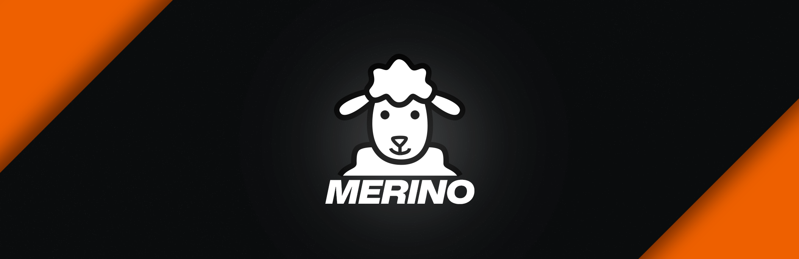

Where privacy and markdown are a standard.

## What is Merino?
_Merino_ is a note taking app (yes, another one 😅) designed to be private & easy-to use with markdown support first.

**The _first_ note taking app where block style editing meets markdown.**

### First where block style meets markdown?
_You might have that question_, and yes, it's true that Notion exists, and also Obsidian, both wonderfull note taking apps.

But Merino is different, because we have the block style of Notion, the markdown of Obsidian and differently to Notion, we save the notes as _markdown files_, making it compatible with anything that uses markdown.

> [!WARNING] There will be dragons. The app is kind of an alpha state yet so there are still a lot of functionalities missing and also some weird bugs, but feel welcome to report them if you use it on our issues: https://github.com/merino-app/issues
